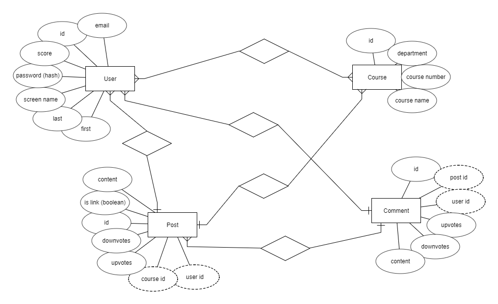

## Milestone 3

*For our database, we are using the package Flask-SQLAlchemy, which integrates the  SQLAlchemy with Flask. SQLAlchemy is a SQL toolkit and ORM for Python.*

The initial entities/models in our database that we have planned are User, Course, Post, and Comment. 
The information inside the models is shown in the diagram, but they are relatively self explanatory and trivial.
The relationship between the models is as follows: 

* One User can have many Courses and one Course can have many Users (many to many)
* A post can have one User and one Course, a User can have many posts, and a Course can have many posts (one to many)
* A comment can have one User and one Post, a Post can have many comments, and a User can have many comments (one to many)