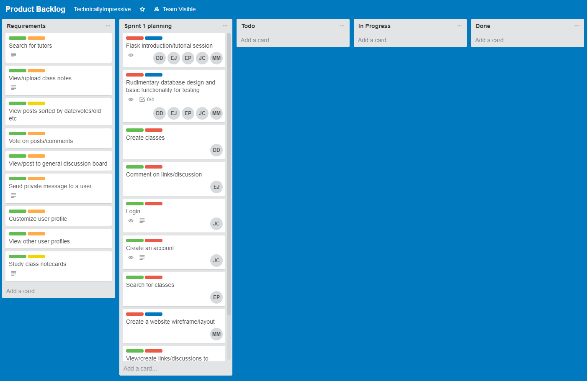
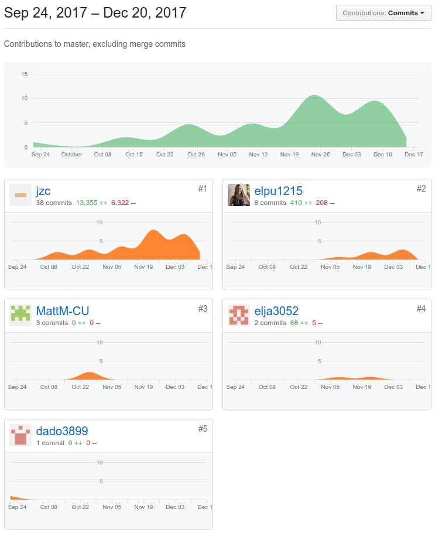

* Title: CS Connections
* Who: Justin Cai, Matt Menten, Ellie Puls, David Doan, Eli Jacobshagen
* Project Tracker: Trello, https://trello.com/b/lNkCHdgP

* VCS: Git/GitHub, https://github.com/jzc/technicallyimpressive

* Deployment: Our app was deployed through Heroku, link is here https://technicallyimpressive.herokuapp.com/. It is easy to deploy to 
Heroku as they offer free plans, and deploying was simply making a Procfile, connecting the database, and push to the remote branch.